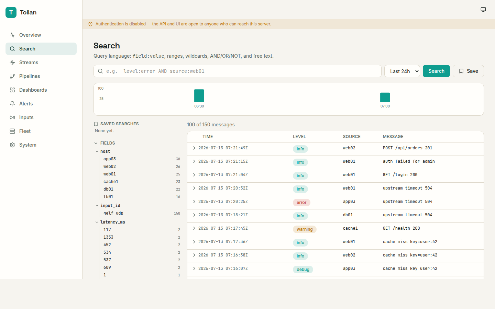
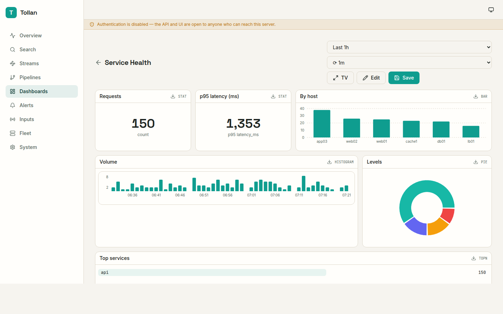
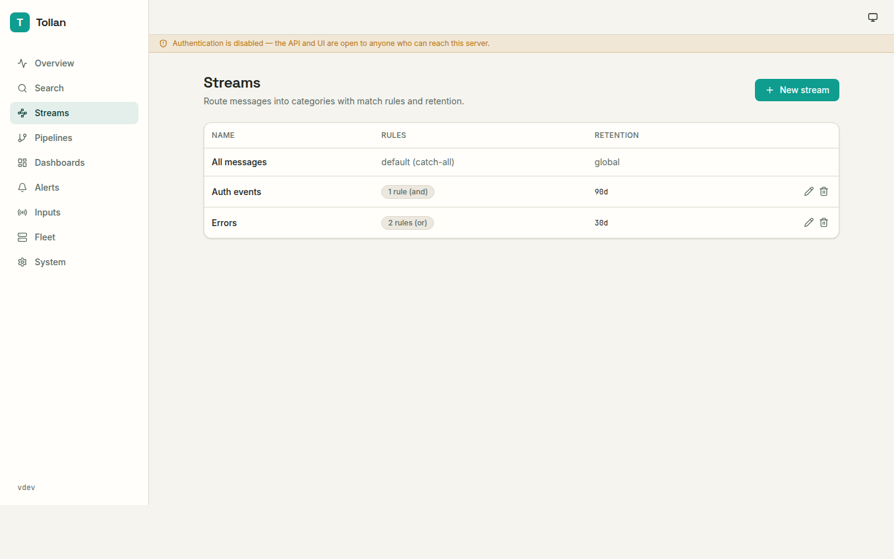
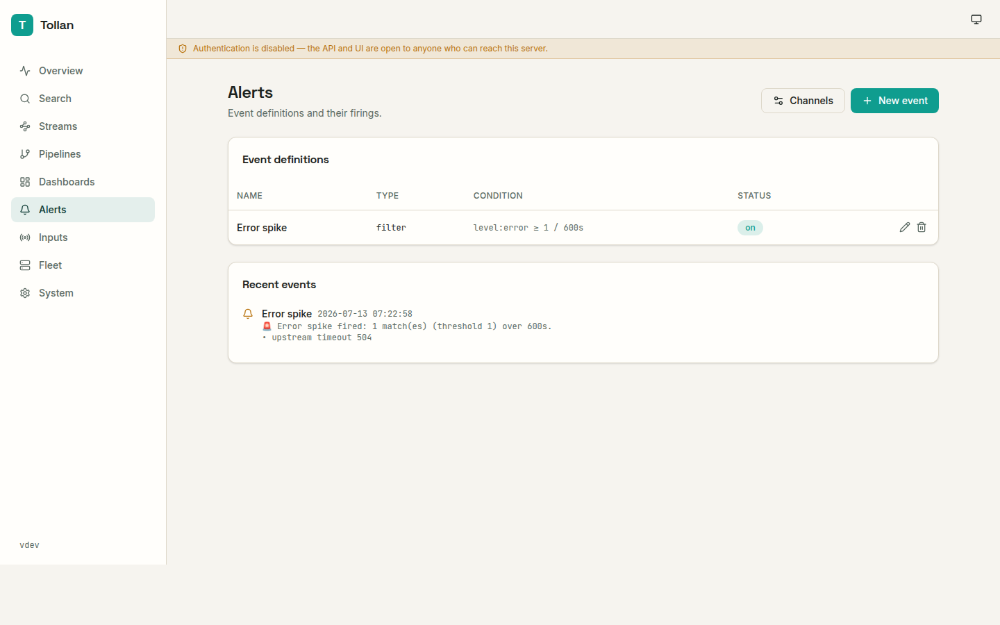
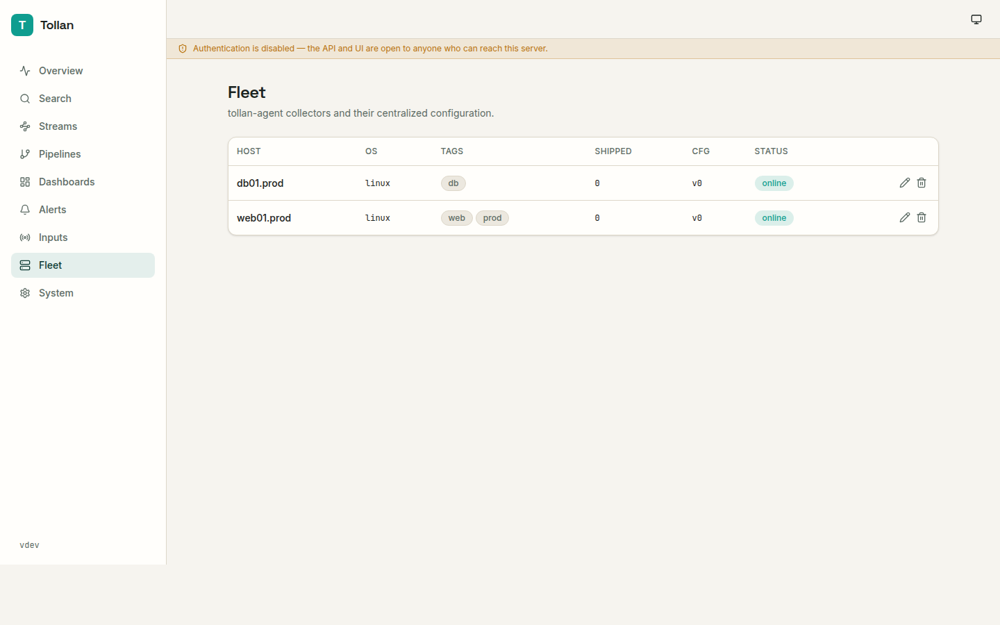
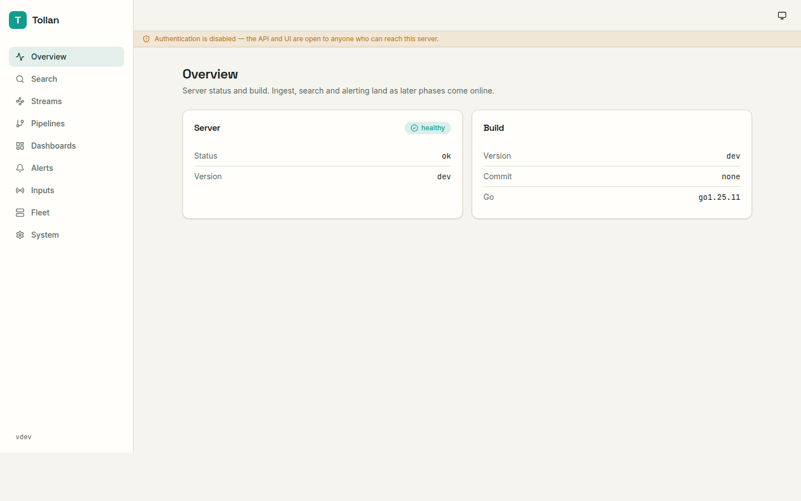

# Tollan

**Tollan** is a self-hosted log management server in a single Go binary (or a
~17 MB scratch Docker image). It ingests logs over many protocols, normalizes
them through pipelines, routes them into streams, stores them in a searchable
time-series log store, and exposes search, dashboards, alerting, outputs and
role-based access control through a modern web UI and a documented REST API.

Feature target: **full parity with the "Graylog Open" column** of the Graylog
feature list — without the JVM, Elasticsearch or MongoDB. Tollan is one static
binary plus a `data/` directory.

- **Zero external dependencies** — pure-Go, `CGO_ENABLED=0`. Storage is SQLite
  (one file per UTC day, FTS5-indexed); metadata is a second SQLite file.
- **Runs three ways**, all first-class: Docker (`techblog/tollan`, scratch,
  multi-arch), a native Linux binary that self-registers as a **systemd**
  service, and a native Windows binary that self-registers as a **Windows
  Service**.
- **Companion `tollan-agent`** for fleet log collection with centralized config.

Licensed under Apache-2.0.

---

## Screenshots

### Search
Lucene-style query language, a time histogram, and a guided-search sidebar of
fields with click-to-filter values.



### Dashboards
A responsive widget grid — stat tiles, bar/line/area/pie charts, histograms,
top-N tables and a GeoIP world map — with per-widget queries, auto-refresh, a
full-screen TV mode, and CSV/JSON export.



### Streams & pipelines
Route messages into categories with match rules; normalize and enrich them with
a `when … then …` rule pipeline (grok, key=value, JSON/CSV, GeoIP, lookups).



### Alerts
Filter and aggregation event definitions that fan out to Shoutrrr, WhatsApp,
webhook and email channels (credentials encrypted at rest).



### Fleet
`tollan-agent` collectors with status, shipped volume and centrally-managed
collector configuration.



### Overview
Server health and build at a glance.



The UI is mobile-first and ships a system-aware light/dark theme.

---

## Quick start

### Docker

```bash
docker run -d --name tollan \
  -p 8080:8080 \
  -p 514:1514/udp -p 12201:12201/udp \
  -p 5044:5044 -p 2055:2055/udp -p 4739:4739/udp \
  -v tollan-data:/data \
  techblog/tollan:latest
```

Or with the provided `docker-compose.yml`:

```bash
docker compose up -d
```

Open <http://localhost:8080> and complete the first-run admin setup.

### Binary

Download a release archive for your platform, then:

```bash
./tollan run                 # foreground
./tollan service install     # register as a systemd / Windows service
./tollan service start
./tollan admin create        # create an admin user (or use the UI wizard)
```

The Linux service installs hardened: a dedicated `tollan` user,
`Restart=on-failure`, and `AmbientCapabilities=CAP_NET_BIND_SERVICE` so inputs
may bind privileged ports such as 514.

---

## Inputs

Inputs are listeners you start without restarting the server. Defaults bind
unprivileged ports; map `514:1514` in Docker for standard syslog.

| Type | Transport | Default port |
|---|---|---|
| Syslog (RFC 3164 & 5424, autodetect, structured data) | UDP, TCP, TCP+TLS | 1514 / 6514 |
| GELF 1.1 (chunked, gzip/zlib) | UDP, TCP, HTTP | 12201 |
| CEF (ArcSight) | UDP, TCP | — |
| Beats (Lumberjack v2) | TCP (+TLS) | 5044 |
| HTTP-JSON (single + NDJSON bulk, token auth) | HTTP | — |
| Raw plain text | UDP, TCP | — |
| NetFlow v5 / v9 | UDP | 2055 |
| IPFIX | UDP | 4739 |

---

## Search query language

A Lucene-style subset, compiled to SQL over typed columns and the FTS5 index:

```
level:error AND source:web01           field predicates + boolean operators
status:>=500                           numeric comparison
status:[400 TO 599]                    range
source:web*                            wildcard
_exists_:src_ip                        field presence
"disk full" OR timeout                 phrases and free text
NOT level:debug
```

Search supports relative time ranges (`now-15m`), a result histogram, saved
searches, and export.

---

## Pipeline rules

Pipelines are ordered rules attached to stages (`_all` runs before routing; a
stream id runs after). A rule is `when <condition> then <actions>`:

```
when has(src_ip) && cidr(src_ip, "10.0.0.0/8")
then set("network", "internal"); geoip(src_ip)

when eq(program, "nginx")
then grok(message, "%{IPORHOST:clientip} .* \"%{HTTPMETHOD:verb} %{URIPATH:path}"); coerce(status, "int")
```

Conditions: `has`, `eq`/`neq`, `regex`, `cidr`, `contains`, `gt`/`lt`/`gte`/`lte`,
combined with `&&`, `||`, `!`. Actions: `set`, `rename`, `remove`, `coerce`,
`parse_json`, `parse_kv`, `parse_csv`, `grok`, `regex_extract`, `lookup`,
`geoip`, `route`, `drop`.

GeoIP uses a MaxMind/IPinfo `.mmdb` you supply (`geoip.db_path`); no database is
bundled.

---

## The agent

`tollan-agent` tails files (and journald on Linux), ships events to a server
over GELF, sends heartbeats, and applies server-pushed collector config.

```bash
tollan-agent run \
  --server http://tollan:8080 \
  --token  "<enrollment-token>" \
  --file '/var/log/*.log' --tags web,prod

tollan-agent service install --server http://tollan:8080 --token …
```

It enrolls with the server (guarded by `agent.enrollment_token`), receives a
per-agent secret for its heartbeat/config calls, and appears on the **Fleet**
page where its collector configuration can be edited centrally.

---

## Configuration

Precedence: **flags > environment (`TOLLAN_` prefix) > YAML file > defaults.**

| Flag | Env | Default | Purpose |
|---|---|---|---|
| `--data-dir` | `TOLLAN_DATA_DIR` | `./data` | Journal, log partitions, metadata |
| `--http-addr` | `TOLLAN_HTTP_ADDR` | `:8080` | UI/API listen address |
| `--log-level` | `TOLLAN_LOG_LEVEL` | `info` | `debug`/`info`/`warning`/`error` |
| `--log-format` | `TOLLAN_LOG_FORMAT` | `text` | `text` or `json` |
| `--auth` | `TOLLAN_AUTH_MODE` | `enabled` | `enabled` or `disabled` (lab) |
| `--config` | — | — | Path to a YAML config file |

See `config.example.yaml` for inputs, GeoIP, retention and agent settings.

Access control has three roles — **Admin**, **Editor**, **Viewer** — plus
per-user, revocable **API tokens** (`Authorization: Bearer …`).

---

## REST API

Everything the UI does is available through the spec-first REST API. The
OpenAPI 3 specification is served at `/api/openapi.yaml` and browsable docs at
`/api/docs`. The canonical spec lives in [`api/openapi.yaml`](api/openapi.yaml).

Prometheus metrics are exposed at `/metrics` (messages in/out, journal depth and
utilization, processing lag, per-day store size, search latency, event firings,
output failures).

---

## Architecture

```
inputs → decoders → disk journal → processing workers → stream router → SQLite
                    (bounded,        (pipelines,          │              day store
                     append-only)     extractors,         │              (FTS5)
                                      GeoIP, lookups)   events → notifications
                                                          outputs (GELF/TCP/syslog/stdout)
```

The **journal** is an append-only, size-bounded, segmented queue: inputs write
and return immediately, so ingest bursts are absorbed on disk and processing
runs asynchronously. On the reference x86 box, ingest sustains **>150k msg/s**
into the journal, which drains through decode + FTS indexing at **~8k msg/s**.

---

## Build

Requires Go (see `go.mod`) and Node 20 for the UI.

```bash
cd web && npm ci && npm run build   # builds the embedded UI into web/dist
go build ./cmd/tollan               # server
go build ./cmd/tollan-agent         # agent
```

`scripts/build.sh` cross-compiles both binaries for the full release matrix
(Linux amd64/arm64/armv7/armv6/386, macOS amd64/arm64, Windows amd64/arm64).
`scripts/dev.sh` runs the backend and the Vite dev server together.

---

## License

Apache-2.0. See [LICENSE](LICENSE).
